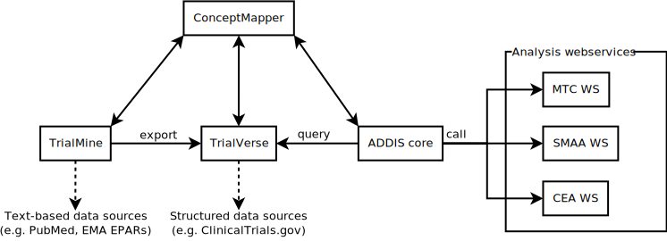
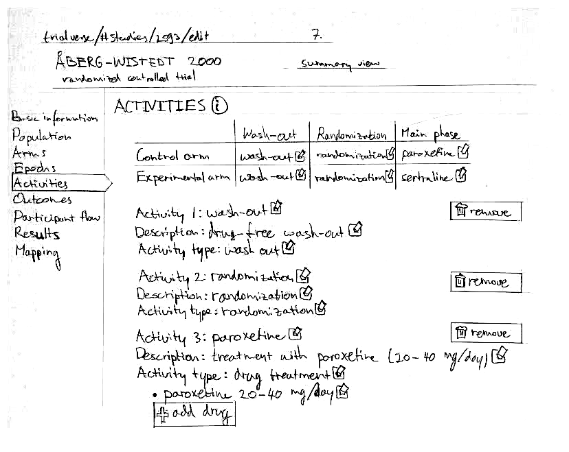

### Status ###

This is a DRAFT of the data management design document for the ADDIS 2 project.
It covers the design of the data management components of ADDIS 2, and is NOT a complete design of the ADDIS 2 system.

This draft is intended to lead to an initial specification to be delivered September 2014.
This initial specification will be revised based on stakeholder feedback, and expanded to include a number of topics that are considered out of scope for the initial specification (e.g. where further input from partners is needed first).

### Context ###

With ADDIS, we want to enable a much more efficient process for evidence-based treatment selection.
This includes evidence-based treatment guidelines, market authorization, and health technology assessment.
To achieve this, three main challenges need to be met:

  1. data acquisition: collecting the relevant evidence
  2. evidence synthesis: statistically combining the evidence (through meta-analysis and modeling)
  3. decision aiding: giving insight in the data and identifying trade-offs

The ADDIS 1.x system focussed on the latter two challenges, but did not address the data acquisition challenge to the extent desired.
In particular, we identify these shortcomings:

  1. ADDIS 1.x does not facilitate identifying relevant trials from the literature to extract data from.
  2. Extracting data is time consuming (unless they can be imported from ClinicalTrials.gov).
  3. ADDIS 1.x is a single-user system, which makes it difficult for teams to collaborate on creating data sets.
  4. ADDIS 1.x lacks a system for managing different versions of data sets, and has no audit trail.
  5. ADDIS 1.x does not allow multiple datasets to be combined for an overall synthesis.

### Purpose ###

The aim of this document is to design a new data management framework for the ADDIS 2 system that remedies the shortcomings of ADDIS 1.x for multi-user work.
In addition, the design will make data acquisition more efficient by allowing for more flexible re-use of previously extracted data, and for post-hoc harmonization of studies extracted by different users.

The IMI GetReal description of work (DoW) anticipates a number of design decisions and in particular identifies a component, called "ConceptMapper" to address the post-hoc harmonization issue.
Specifically, deliverable D4.12 calls for specification of the ConceptMapper component, which should allow for the flexible harmonization of meta-data describing data used in GetReal case studies (task T4.12.2).
This is addressed by the present document.
The ConceptMapper component is further referenced in tasks T4.13.2 and T4.14.2, which cover the development of this component to different stages of maturity; it is also part of milestone M4.5, delivery of the final software platform.

### Limitations ###

Because the GetReal project will explore the interface between randomized controlled trials and real world data (i.e. observational data and pragmatic trials), ADDIS will need to handle observational data to some extent.
Moreover, many case studies within GetReal will work with individual patient data from RCTs to fit models e.g. to predict real world effectiveness.
However, this is not covered by this design document, for the following reasons:

 - Through our work on ADDIS 1, we have significant experience with modeling RCT data, but not with observational data.
 - There is a wide variety of observational study designs, and it is unclear at this time what types of study we will need to deal with, and how the interactions will be structured. This requires further clarification before the design can proceed.
 - While storing published aggregate-level data from RCTs is both useful and uncontroversial, storing either individual participant data from RCTs or from observational studies raises issues of privacy and data ownership.
   Therefore, it seems more likely that such data would not be stored directly by (the public version of) ADDIS.
   Other solutions may need to be explored.

Future versions may address these limitations.
In addition, the components will be structured so that generic structures (e.g. outcomes, interventions, etc.) can be re-used in a future component for real world data.

### Outline ###

This document first covers the overall vision and architectural design of the ADDIS 2 system.
On this foundation, we develop the more detailed requirements of its data management components.
We then propose an initial design based on these requirements and a number of prototypes that have been constructed.

## The ADDIS 2 project ##

This section explains the aims, requirements, and architecture of the ADDIS 2 project insofar as is necessary for an informed discussion of the data management components.

### Vision and values ###

*Note*: this section reflects the views of the ADDIS development team, and not necessarily those of the consortium as a whole.

We believe that science needs to be transparent for it to function properly.
This means not only that data should be openly accessible, but also that scientific software must be open source.
This also applies to modeling and decision making based on scientific data, in that both the underlying evidence and the value judgments should be as explicit and transparent as possible to enable accountability.
In the drug development, approval, and reimbursement processes, we want to achieve this by linking the various systems and tools involved, from collecting the evidence to the final decision.
Furthermore, we believe in the power of information technology to enhance the efficiency of commonplace tasks such as data collection and extraction, and the ability of collaborative platforms to eliminate duplication of effort by allowing users to easily share their work, including all intermediate products.

### Aims and objectives within GetReal ###

In short, the main objectives within GetReal are:

 - To develop a viable data management solution for ADDIS that enables collaborative database building by teams of analysts (whether academic teams, drug development teams, or assessment teams)
 - To develop analysis capabilities that align with the GetReal objectives of using real world data in drug development and assessment
 - For the software to serve as a showcase for the methodologies and case studies developed in GetReal
 - To work with industry, HTA, and regulatory stakeholders to explore how ADDIS can be used in drug development and assessment, for example to support submissions to authorities

### Rationale for re-development ###

ADDIS 1 is a cross-platform desktop application implemented in Java, designed for use by a single user.
This introduces two classes of inherent limitations.

First, to maintain cross-platform compatibility, all components needed to run on the JVM (Java Virtual Machine).
Java is not always the best tool for the job at hand, e.g. it is often easier to implement statistical analyses in R.
The constraints of bundling a desktop application make it difficult to choose the best available technology, leading to re-implementation of existing software.
Moreover, with a desktop application we have no control over the execution environment, which means that the application has to be aimed at the lowest common denominator.
For example this means supporting PCs with slow processors, little RAM, or very out-dated versions of the JVM.

Second, because ADDIS is a single-user application in which data are stored in files on the user's computer, sharing and collaborating on data sets is difficult.
ADDIS 1 does not support any way of merging changes made by different users to the same data file.
Although this would be possible in principle, sharing data would still require conscious effort on the part of users.
Rather, we would like sharing to be the default option.

### Non-functional requirements ###

We identify the main goals and non-functional requirements of the ADDIS 2 re-development effort according to five key concerns: valorization, development, research, ecosystem, and learning.

#### Valorization ####

The system should generate sufficient revenue to support its continued development and operation.
Since the business model has not determined, we focus on concerns that are likely to be common to potential approaches.

  - V1 Custom variants for different audiences, such as regulators, reimbursement authorities and industry (product line)
  - V2 `In-house' deployments of the system for when the analyses are confidential / sensitive
  - V3 Access to internal organization data, possibly in conjunction with public data
  - V4 Ease of use: the system should visually attractive to 'sell' it, and be easy to use to limit frustrations and the need for training

#### Development ####

System development should be efficient, agile, and sustainable.

  - D1 Analyses are often computationally intensive; they should run quickly and the system should scale to support many such computations in parallel if needed 
  - D2 There should be flexibility in choosing the right technologies, platforms, and frameworks to implement specific functionality (e.g. statistical computing using R and user interfaces using HTML + JavaScript)
  - D3 The system should be maintainable and hence divided up in loosely coupled components with well-defined APIs
  - D4 To ensure our public APIs are functioning in an optimal manner, our own software should use those APIs 
  - D5 The integrity of data should be closely guarded and all data should have clear provenance and versioning information

#### Research ####

The system should be an enabler for our own research and contribute to the success of grant proposals.

  - R1 Rapid prototyping of new analyses and user interfaces to support new research questions
  - R2 A large database to do research and meta-research
  - R4 Transparency of implementation (open source)
  - R5 Publishable (high quality) graphics and tables 

#### Ecosystem ####

For the ADDIS concept to work, it is critical that structured clinical trials data are available. It is unlikely that any one organization will be able to achieve this. Therefore, we should aim to 'bootstrap' an open ecosystem in which structured clinical trials data can be shared.

  - E1 Create a single collaborative portal for data extraction and sharing (open access / source)
  - E2 Enhance the efficiency of systematic review by 'closing the information chain' (i.e. capturing the entire process from literature screening to analysis)
  - E3 Enable the flexible re-use of data by enabling the definition, re-definition and mapping of meta-data (it should be possible to integrate data extracted by independent teams by mapping the meta-data)
  - E4 Enable automated (third party) data extraction systems (bots) to contribute
  - E5 The system(s) should be easy to use and hassle-free to use (e.g. single sign-on)
  - E6 All data and analyses can be traced back to their ultimate source
  - E7 Third parties should be able to develop new analysis tools and decision support systems based on the available data

#### Learning ####

The system should promote the use of structured, transparent, and quantitative methods in health care policy decisions.

  - L1 Enable access to 'complex' methods and tools through a usable interface for non-experts
  - L2 Clear in-system documentation and links to further reading (e.g. methodology papers)
  - L3 Raise awareness of newer statistical and decision making methods by implementing and applying them

### Sketch of functional requirements ###

Initially, ADDIS 2 is a web-based re-development of ADDIS 1, and therefore the functional requirements are derived from the current ADDIS 1 functionality:

 - A structured database of clinical trials
    * Manual input or semi-automated import from ClinicalTrials.gov
 - Evidence synthesis using network meta-analysis
 - Multiple criteria decision analysis (MCDA) methods to assess trade-offs between multiple outcomes
 - The system guides the creation of analyses, and allows flexibility in how interventions and outcomes are defined

In addition, as part of the IMI GetReal project, functional requirements related to the prediction of relative effectiveness and the use of real world data will be defined.

### Architecture ###

Given that many of the requirements imply loosely coupled and flexibly reusable components with well-defined public APIs (R1, V1, V2, V3, D1, D2, D3, E4, E7), we will assume that a service-based (and web-based) architecture is most appropriate. We distinguish the following components:

  - Web services that implement the different analyses (R1, D1, D2)
  - ADDIS-core, a 'business intelligence' system for drug benefit-risk analysis (V1, D3, L1) (basically a 'workflow engine' in which different ways of going from a database of trials to analyses can be implemented)
  - TrialVerse, a portal/database where researchers share structured RCT data (V3, D3, D4, E1)
  - TrialMine, a system for literature screening (E2)
  - ConceptMapper, a shared component where definitions (concepts) can be deposited, refined, and mapped (R2, E1, E2, E3)
  - A user management component underlying all systems (V4, D3, E5)

The user-facing systems have a back-end that exposes an API, and an HTML + JavaScript GUI that calls that API (D2, D4). It is intended that this will enable third parties to create additional 'business intelligence' systems based on TrialVerse (E7). Moreover, the API can be used to build, test, and use automated systems for the extraction of data (E4). While the two user-facing systems have clearly separated concerns, they will be tightly integrated (E5), for example using:

  - Single sign-on authentication
  - Shared user and organization profiles
  - Consistent visual identity

We also want to support corporate deployments of the ADDIS system (V2). This is possible because TrialVerse exposes a well-defined API. We can then do the following:

  1. Deploy an internal system exposing company data through the TrialVerse interface (V3)
  2. Deploy an internal version of ADDIS that has access to both TrialVerse and the internal database
(V2)
  3. (Optional) internal deployment of the analysis web services (V2)

To better support this scenario there should be clearly separated read-only (to be used by ADDIS) and read-write (to be used by the TrialVerse GUI) interfaces for TrialVerse.

## Data management ##

In the ADDIS 2 architecture, the responsibility for data management is shared by the TrialVerse and ConceptMapper components:

 - TrialVerse: where researchers share structured RCT data
 - ConceptMapper: where definitions (concepts) can be deposited, refined, and mapped

We now proceed to design these two components in tandem, to arrive at an optimal solution for RCT data management in ADDIS 2.
However, in doing so we keep in mind that the ConceptMapper component is expected to collaborate with other components besides TrialVerse, e.g. components dealing with real world data.

### Requirements ###

This section elaborates on the requirements for the data management component, some of which will be from the perspective of an end-user, while others may be from the perspective of another software component interacting with the system or an organization wishing to make use of ADDIS 2.

Note that not all functional requirements need to be satisfied by direct implementation in ADDIS.
Some could also be achieved by interoperation with other systems.
Moreover, all features are subject to prioritization and therefore it is likely that not all of the requirements will be satisfied by the end of the project.
The main aim of listing them here is to provide a basis for the overall design of the system and for the prioritization of features.

#### Working with a dataset ####

These requirements cover how we expect users to interact with a completed dataset, i.e. a single version of a dataset as it is used in an analysis project in ADDIS.
These are intentionally broad, as the specific analysis functionality to be built is out of scope for this document.

**F1.1** Any authenticated user must be able to create a project based on an available dataset. A title and description of the project must be provided by the user.

**F1.2** When viewing a project, any user must be presented with information on the dataset on which it is based. This information must link to a detailed view of this dataset (F1.5). (See [Mockup 001](#mockup001))

**F1.3** Any project participant must be able to create logical matching rules that define an intervention or an outcome. Such matching rules should be able to make use of terms from structured terminologies (e.g. ATC codes), as well as set restrictions on other properties such as dose. Templates should be provided for common scenarios (e.g. drug treatments). (See [Mockup 011](#mockup011))

**F1.4** ADDIS must be able to automatically apply defined matching rules (F1.3) to the project dataset to create analysis datasets for e.g. network meta-analysis. Matching should be intelligent, and e.g. make use of mappings between terminologies. For example, listing both the ATC code and the SNOMED CT code as in [Mockup 011](#mockup011) could be redundant if it is already known that these concepts are equivalent.

**F1.5** When viewing a dataset, the user is shown information on how study inclusion was decided upon, as well as how data were extracted. (See [Mockup 002](#mockup002))

**F1.6** When viewing a dataset, the user is shown a table of basic information on each of the studies included in that dataset. Each row links to a detailed record on that study (F1.7). (See [Mockup 002](#mockup002))

**F1.7** When viewing a study, the user is first presented with a summary view of the key characteristics. This summary view links to a details view. (See [Mockup 005](#mockup005))

**F1.8** The detailed view shows the full semantic detail of the study, including basic study characteristics, population and eligibility information, the arms and epochs ([Mockup 006](#mockup006)), the activities performed ([Mockup 007](#mockup007)), the predefined outcome measures, the actual participant flow, study results, and the mapping of study concepts to structured vocabularies and ontologies ([Mockup 008](#mockup008)).

#### Provenance and versioning ####

Because the analyses being done in ADDIS potentially have a large impact, it is important to keep track of how datasets originated, and who made particular changes.

**F2.1** Users must be able to log in to the system. The system must enforce that a user is logged in before they can make changes to any extraction or dataset.

**F2.2** When a dataset or extraction is updated, ADDIS must be able to access the older versions of that record, so that an analysis that is based on an older version will continue to work and will continue to yield the same results ([Mockup 001](#mockup001)).

**F2.3** When viewing a dataset or extraction, the user is shown information on who created it, whether this is the most recent version, and when it has last been updated ([Mockup 002](#mockup002), [003](#mockup003), [015](#mockup015)).

**F2.4** The user must be able to verify the entire edit history of a dataset or extraction, including who made the changes and what were the precise changes made ([Mockup 013](#mockup013), [009](#mockup009)).

**F2.5** A logged in user can edit any dataset or extraction. When doing so, these changes are continuously saved to their working copy on their account. When the user is satisfied with the changes, they are prompted to check them before saving, and to provide a description of the reasons for their changes ([Mockup 009](#mockup009)). Only changes that have been so saved will be available outside of the edit view for that dataset or extraction. If the dataset or extraction was previously created by another user, saving an edited version will create a full copy of the record, including the full history.

**F2.6** Users who have created datasets or extractions are notified when other users have made changes to their records, and are prompted to accept or reject these changes ([Mockup 016](#mockup016)).

**F2.7** Multiple alternative extractions of a single object may exist. When viewing an extraction, this is clearly displayed to users ([Mockup003](#mockup003)).

**F2.8** The system should encourage contributions by clearly assigning credit for extractions and datasets. For example, a user profile page can showcase contributions made by the user ([Mockup 012](#mockup012)).

**F2.9** Extractions or partial extractions of publications or registry entries can also be made by software agents.
Credit for such extractions should be assigned to both the software agent and the entity that initiated the running of the software agent ([Mockup 016](#mockup016)).

**F2.10** Extractions can be performed using predefined extraction forms, where the system provides a mapping from the extraction forms to the appropriate data structures.

#### Creating datasets ####

Datasets are collections of studies together with their meta-data.

**F3.1** Any user must be able to create a new dataset. The user will be prompted to provide a title and a description, as well as a method for study selection (F3.2-F3.5) and for data extraction (F3.6; F4.*).

**F3.2** Studies can be selected based on the inclusions of an existing systematic review, by referring to a specific extraction of that review ([Mockup 002](#mockup002), [003](#mockup003)).

**F3.3** Studies can be selected based on the inclusions of several existing systematic reviews, by referring to specific extractions of those reviews (umbrella reviews).

**F3.4** Studies can be selected ad hoc from the full database.

**F3.5** Studies can be selected based on a literature screening project (i.e. a pre-defined list of publications).

**F3.6** The dataset can refer to pre-existing extractions of the selected studies.

#### Data entry and import ####

There must be a way of users to enter data for use in analyses.
The system should aim to make this as painless and efficient as possible, for example by exploiting existing sources of structured data.
However, users must be in complete control of the final extraction.

**F4.1** The study edit view allows the user to edit the full semantic detail of the study, including basic study characteristics, population and eligibility information, the arms and epochs ([Mockup 006](#mockup006)), the activities performed ([Mockup 007](#mockup007)), the predefined outcome measures, the actual participant flow, study results, and the mapping of study concepts to structured vocabularies and ontologies ([Mockup 008](#mockup008)).
These are represented at a sufficient level of detail to allow automated matching and reasoning by ADDIS, but the user interface is specialized to presenting RCT information to users so that entering data correctly is not an overly complex task.

**F4.2** Extractions can be created by annotating the abstract or full text of an article.
The user will be able to highlight text as being relevant to certain pre-defined labels (e.g. interventions, outcomes, etc.) and this will result in the textual information being copied into the appropriate location of the data entry view (F4.1).
More refined functionality could also allow the user to create entities directly from the annotation view.

**F4.3** The system will continuously extract and update data from ClinicalTrials.gov records (and potentially other structured sources). As per F4.1 and F2.5, users can further complete and refine such extractions ([Mockup 016](#mockup016)).

**F4.4** Third parties are able to deploy their own software agents to contribute automated extractions similar to F4.4.

**F4.5** The user will be able to define concepts (e.g. outcomes and interventions) in terms of higher level concepts though the use of logical relationships ([Mockup 012](#mockup012)).
The higher level concepts could be (1) references to terms from well-known vocabularies, (2) references to concepts defined by users (F4.5), or (3) placeholders defined only within the study.
The system should offer interfaces of varying levels of complexity, for example templates for common types of definitions and direct access to the underlying representation for complex cases.

**F4.6** The user is able to define their own terminologies, and these are subject to the same versioning and provenance requirements as all other data (F2.*).
In the most basic form this means just defining terms and their descriptions.
More advanced users will be able to create (or upload) a set of terms with their interrelationships (similar to e.g. SNOMED CT).

#### Working together; curation and discussion ####

To create large and reliable sets of randomized controlled trials it is important that teams can work together, both to tackle larger numbers of studies and to ensure reliable data entry.

**F5.1** Projects with multiple participants will be able to set rules for study selection and data extraction to ensure a certain level of quality (F5.2-F5.4).
In part, this is supported by the ability to view edit histories and changes between versions (F2.*).

**F5.2** Group data entry without any restrictions: participants can select existing extractions for use in the project, or perform data extractions ad hoc.

**F5.3** Group data entry without use of existing extractions.

**F5.4** Double- or triple-blind data extraction with resolution of conflicts. The system detects and rates agreement between extractors.

**F5.5** The system will enable curation: users can create large collections containing the highest quality extractions relevant to a certain area. This may or may not be automated, in whole or in part.

**F5.6** The system should enable users to discuss difficult extractions, and these discussion should clearly be linked to the extrations (or versions thereof) at hand.

**F5.7** The system will collect metrics on users, in order to assess their impact and reliability.
Among other things, this will aim to detect fraudulent or other anomolous behaviour.

#### In-house deployments ####

For industry and HTA stakeholders in-house deployments of the software will be important. This will allow them to keep sensitive data and analyses private.

**F6.1** It must be possible do deploy ADDIS in-house.

**F6.2** It must be possible to build front-ends for in-house databases so that the in-house ADDIS can interface with them.

**F6.3** It must be possible for ADDIS to interface with multiple data sources, for example multiple in-house systems or an in-house data source and the public version of ADDIS.

**F6.4** There must be an interchange format and functionality to selectively transfer data and analyses without allowing third parties access to those data. For example to transfer data from industry to HTA systems.

#### Embargo ####

By default, all data entered in ADDIS will be public (but in the case of in-house deployments a company may limit who can access the system).
Some teams may wish to limit access to their data for a time, for example so that they can publish their review before others can make use of the data.
For-pay temporary embargoes of project data is a potential business model for ADDIS.

**F7.1** The system should allow users to pay to place their data under embargo. The data will be disclosed after a pre-specified amount of time, or until publication of an article (whichever comes first).

**F7.2** After an embargo is lifted, the full edit history of the data are made public. The parts of the history that have been under embargo will be annotated with the terms and begin and end date of the embargo.

### Preliminary design ###

This describes the rough design (conceptual model) of the data management components of ADDIS 2.
It is motivated by the overall requirements and architecture of ADDIS 2 (Section 2) and the functional requirements of the data management components (Section 3.1).
It is further informed by a number of prototypes that were constructed to explore the design space for the data management components (Section 3.3).

#### Knowledge representation using semantic web technologies ####

Semantic web technologies provide a common framework that allows data to be shared and reused across application, enterprise, and community boundaries.
They do this by enabling automated reasoning about the meaning (semantics) of the data.
The Resource Description Framework (RDF) is the foundation of the semantic web, and enables the description of resources in the form of subject-predicate-object triples.
Because predicates are first class objects in RDF, their properties can also be described using RDF.
This makes RDF an incredibly powerful and flexible way of describing data and meta-data.
Collections of triples are called graphs, and such graphs can be assigned a name so that they themselves can be described using RDF.
Named graphs are a useful way of recording context information on a collection of statements, for example their provenance.
Databases that store data in RDF format are called triple stores, and we have selected the Apache Jena triple store for ADDIS 2 (see Section 3.3.2).

A large number of tools for knowledge representation, reasoning, and querying build on top of RDF.
This includes the Web Ontology Language (OWL), a widely used language for knowledge representation that is supported by a variety of reasoning software.
OWL has been used in many knowledge representation project in the biomedical domain, and is the underlying technology for the [NCBO BioPortal](http://bioportal.bioontology.org/), among others.
Many key vocabularies and ontologies in medicine are either primarily developed in OWL, or have a derived representation in OWL.
Examples include the SNOMED Clinical Terms, the BRIDG model, and the Ontology of Clinical Research (OCRe).
OWL is also a key enabling technology in the IMI Open PHACTS project, which aims for wider integration of pharmacological data across the industry.

Because semantic web technologies were designed to allow flexible modeling of the semantics of heterogeneous data sources, they are a good fit for the modeling of complex concepts, where we can not anticipate the data modeling needs completely (F4.5-6).
Moreover, a range of mature tools for both automated reasoning and rule-based matching are available, which could form the underlying technology for a more flexible system of matching complex concepts for analysis (F1.4-5).
This is further aided by the availability of many standard vocabularies and ontologies in a compatible format (F1.4, F4.5).
Named graphs provide a natural mechanism for recording provenance information (F2.3).
As described in Section 3.3, an RDF representation of the ADDIS 1 data model has already been developed and successfully applied to perform basic matching tasks like those performed by ADDIS 1.
Future work will aim to align the data model further with the BRIDG model and other CDISC standards, as well as the OCRe.

Because there are a number of interchange formats for RDF, any data stored in an RDF triple store can easily be transferred to other parties (F6.4).
RDF can also be nested in XML documents, so could in principle also be used to enhance files in the current ADDIS 1 XML format.

#### TrialVerse and ConceptMapper ####

TrialVerse and ConceptMapper are closely related components that must work together well for data management in ADDIS 2 to be successful.
Therefore, most of this document does not make a clear distinction between the two, but rather looks at what both components must be able to achieve when used together.
As defined in the architecture, the division between the components is as follows:

  - TrialVerse: where researchers share structured RCT data
  - ConceptMapper: where definitions (concepts) can be deposited, refined, and mapped

We can now describe the responsibilities and characteristics of these components in more detail.

##### TrialVerse #####

The TrialVerse component is responsible for all data that is specific to a single randomized controlled trial.
Typically these data conform to a relatively well known data model that corresponds closely to the one developed for ADDIS 1.
The constrained domain for this component allows us to develop a user-friendly data entry interface where expertise in knowledge representation will not be required (F4.1-2).
TrialVerse will integrate ConceptMapper to provide the "Mappings" feature (F4.5-6), where more fine-grained descriptions of e.g. interventions and outcomes can be provided.

##### ConceptMapper #####

ConceptMapper is a repository for higher level concepts and their interrelationships.
It should allow access to existing vocabularies and ontologies (provided that an appropriate license can be obtained) as well as allow users to create their own concepts and mappings (F4.5-6).
It is responsible for handling the less well defined structures in clinical trials, such as the semantics of interventions and outcomes.
This is a complex domain, and for users with knowledge representation expertise there will be a low level interface that enables direct access to the underlying representation.
In addition to this, we will enable less experienced users to define the most common types through predefined templates.
That this component is separate from TrialVerse is key to our strategy for integrating other sources of data besides RCTs in the future (Section 2).

ConceptMapper is also responsible for providing functionality for the matching of intervention and outcome concepts to the ADDIS 2 analysis components, as well as the user interface components for defining matching rules.

#### Versioning and Provenance ####

It is important to keep an accurate audit trail and a user accessible log of changes made to any record in TrialVerse and ConceptMapper (F2.*).
To this end, we will implement the [event sourcing](http://martinfowler.com/eaaDev/EventSourcing.html) design pattern on top of RDF named graphs.
In event sourcing, a record of every change made to the database (event) is kept, and the state at any past point in time can be reconstructed from that event log.
In simple terms, this is achieved as follows:

 - For every "chunk" of data (e.g. a randomized controlled trial, an ontology, or a dataset) a named graph is created. Think of this as a document.
 - Every time the named graph is edited and saved, the added and removed triples are recorded, together with information on when the changes were made and by whom.
 - Every version of every named graph is given a unique ID. In effect, we construct a graph of previous versions of each named graph.
 - Note that both the data (named graphs) and the meta-data (provenance information) can be stored in RDF. A prototype implementation of this was constructed (Section 3.3.3).

This implementation of the event sourcing pattern is also inspired by the [Datomic](http://www.datomic.com/) immutable database and the [Git](http://git-scm.com/) version control system.

By implementing the database in this way, all past versions of the data can be reconstructed as needed (F2.2) and provenance information including a full edit history is always accessible (F2.3, F2.4).
Moreover, because the history of an entry by one user can be referred to from further edits by another user, it becomes trivial to let any user non-destructively edit any entry (F2.5), and it is trivial to detect when this has happened (F2.6).
The stability of an event sourced database is also important from the perspective of integrating data from multiple deployments of TrialVerse and/or ConceptMapper: once a specific version of a graph is known, it will never change (F6.3).
The recorded provenance information is also a solid basis for assigning credit for contributions (F2.8).

The above assumes the ability to calculate differences between RDF graphs, and to apply those differences to RDF graphs.
Approaches for this have been discussed in the literature (e.g. Auer and Herre, 2007, A Versioning and Evolution Framework for RDF Knowledge Bases, Perspectives of Systems Informatics, Lecture Notes in Computer Science 4378:55-69).

#### Collaboration ####

The basic model for collaboration builds on the ability to reason about versions of RDF graphs and the differences between those versions (as discussed in the Section 3.2.3).
Because every version of a graph has a unique identifier, even when changes are made by another person than the original author, the version history can correctly refer back to the previous versions by the original author (F2.5).
This enables a very general model for collaboration where users can decide whether or not to include changes made by others in their own dataset (F5.1, F5.2, F5.5).
Moreover, users are asked to accompany every version with a short message that explains the intention and reasoning behind their changes, this creates a venue for discussion (F5.6).
This will be expanded further to allow others to comment on specific versions, e.g. to respond to the reasoning by the version author or to point out a mistake (F5.6).

Selectively applying specific sets of changes to an extraction is not trivial, and not always possible.
The paper referenced above (Auer and Herre, 2007) outlines a possible approach, and further implementation details can be taken from source control systems such as Git.

Other methods for collaboration would build on top of this system.
For example, a group of researchers could work to build a curated dataset of depression trials by constantly monitoring the database for changes and additions to those trials and vetting them before they become part of the curated dataset.
Rules for systematic review projects (e.g. double data entry) could also be implemented on top of this system, either through human intervention or by the application of an automated ruleset (F5.3, F5.4).

#### Authentication ####

The [OAuth 2.0](http://oauth.net/2/), an open industry standard specification for authentication on the internet, will be used to authenticate users for ADDIS 2 (F2.1).
Our preferred authentication provider will be [ORCiD](http://orcid.org), the open researcher and contributor ID, which is currently emerging as the de facto standard in scientific publishing.
It has been adopted by most major publishers as well as a number of funding bodies and universities, among others.
This will not only enable us to authenticate researchers, but also to automatically link their profiles to their scientific track record.

In addition, because OAuth is an open standard, it should also allow straightforward integration with other authentication providers, e.g. in-house systems (F6.1).

### Prototypes ###

To explore the design space for the TrialVerse and ConceptMapper components, several prototypes were constructed.

#### Vertical prototype ####

A vertical prototype was constructed as a proof-of-concept of how the ConceptMapper, TrialVerse, and Core components would interact.
It was constructed in short bursts of activity during the design phase of the ADDIS 2 architecture (Jan 2013), during the specification of the IMI GetReal DoW (Apr 2013), and during the run up to the GetReal project (Aug & Sep 2013). It consisted of:

 - A relational database schema for RCTs ("TrialVerse")
 - An RDF triplestore with semantic meta-data for between-studies information ("ConceptMapper")
 - An importer for .ADDIS files to TrialVerse/ConceptMapper format
 - A throw-away prototype that constructed network meta-analysis by querying TrialVerse/ConceptMapper ("Core")
 - A throw-away prototype network meta-analysis component based on the [gemtc](https://github.com/gertvv/gemtc) package for R and [Patavi](https://github.com/joelkuiper/patavi)

In particular, the prototype defined [RESTful](http://en.wikipedia.org/wiki/Representational_state_transfer) web services to expose the RCT data and meta-data.
The "Core" component used these interfaces to construct datasets compatible with the user's requests.
The client (running in a web browser, based on the [AngularJS](https://angularjs.org/) framework) in turn interacted with the "Core" component using RESTful interfaces.

The development of the prototype allowed us to verify that the import of .ADDIS files was sufficiently complete to allow constructing analysis datasets.
As a result of the prototyping work, we fine-tuned both the relational data model and the RDF representation of the meta-data.
However, significant tension remains: for example the definition of interventions is largely defined in the relational data model, which limits its flexibility to drug-based interventions, and limits semantic rules to matching the definitions of drugs (i.e. compounds) rather than the entire intervention regimen.
We also discovered that the REST interface we defined originally did not allow us to optimize query performance sufficiently, and therefore it required a redesign.

#### Triple stores, existing terminologies ####

A second prototype explored the capabilities of a number of existing triple stores, as well as their ability to handle key medical terminologies such as SNOMED CT, the ATC classification, ICD-10, MedDRA, and LOINC.
In addition, a prototype web frontend allowed full-text search within these terminologies, as well as browsing their hierarchy.
Mappings to ADDIS datasets could also be retrieved.
Through this process, we identified Apache Jena (with Fuseki) as the triplestore of choice.
It could easily handle the relatively large terminologies, and can support the much larger sets of triples that we expect to store in the future.
It also has good support for the SPARQL 1.1 specification and full text indexing (using a Lucene plugin), requirements we also discovered thanks to this prototype.
Finally, Apache Jena is an open source project with a very extensible architecture.

#### Event sourcing with RDF ####

[Event sourcing](http://martinfowler.com/eaaDev/EventSourcing.html) is a design pattern for the design of applications in which every change to the state of the application needs to be captured.
This allows for example reconstructing the state of the application at any past point in time.
An implementation of this design pattern using RDF named graphs was designed and tested, first using a static dataset and a number of SPARQL queries.
Subsequently, an extension to the Fuseki web service for Jena was developed.
It enabled fully transparent SPARQL querying of the store at any point in time, as well as updating the store using a REST interface.

#### Pure RDF data model ####

The initial vertical prototype used a relational database for the more well-defined parts of the data model (i.e. those describing the study design and measurements) and a triple store for the more open-ended parts (i.e. higher level concepts).
However, this generates some tension at the interface between these components.
In addition, an event sourcing implementation would have to work across this barrier, so would need to be implemented consistently for these two very different technology stacks.
Therefore, another prototype was constructed to evaluate the possibility of using a triple store for both TrialVerse and ConceptMapper.
This consists of a converter from ADDIS datafiles to RDF, and a set of SPARQL queries implementing the key used cases from the ADDIS point of view (i.e. matching studies to concept definitions and constructing datasets).
This was successful and should allow for a full implementation of the "read-only API" envisaged in the ADDIS 2 architecture.

#### ADDIS 2 R1 - R3 ####

The relational database schema, triplestore, and importer were deemed to be of sufficient quality to serve as the basis of the initial releases of ADDIS 2, pending the further design of the TrialVerse and ConceptMapper components.
Several design decisions of the prototype were also carried over, such as implementing the backend using Java and the Spring framework and the frontend using AngularJS.
Although the Core component developed during Releases 1-3 is not considered a prototype, the TrialVerse and ConceptMapper components are, and are expected to undergo a full rewrite.
The first two releases were based on the relational database model, and a transition to the RDF data model was made in Release 3.

### Mockups ###

The mockups are unfortunately crude hand drawings for now.
At the top of each mockup is a mock address bar with an example URL and a mockup number.
Generally titles are given in all capital letters and hyperlinks are indicated by an underline.
Often hyperlinks refer to other mockups, which is indicated with an arrow pointing to the number of that mockup.
Links to outside of the system are inidicated by a box with an arrow pointing out of it (this element would also be shown in the final system).
A pencil pointing into a box is used as a general "edit" icon / button.

<a name="mockup001">

**Mockup 001** Project overview.
</a>

<a name="mockup002">

**Mockup 002** Dataset overview when a more recent version is available.
</a>

<a name="mockup003">

**Mockup 003** Dataset overview when it is the most recent version.
</a>

<a name="mockup004">

**Mockup 004** Overview of a partially extracted systematic review.
</a>

<a name="mockup005">

**Mockup 005** Summary view of an extracted RCT.
</a>

<a name="mockup006">

**Mockup 006** Details view of an extracted RCT: arms and epochs.
</a>

<a name="mockup007">

**Mockup 007** Details view of an extracted RCT: activities.
</a>

<a name="mockup008">

**Mockup 008** Details view of an extracted RCT: mapping entities to higher-level concepts.
The user has made changes to this extraction (indicated bottom left).
</a>

<a name="mockup009">

**Mockup 009** Checking and saving changes made to a data extraction.
</a>

<a name="mockup010">

**Mockup 010** Starting a new extraction based on a PubMed abstract.
</a>

<a name="mockup011">

**Mockup 011** Defining an intervention matching rule in ADDIS.
</a>

<a name="mockup012">

**Mockup 012** Defining a concept mapping based on a predefined template in TrialVerse.
</a>

<a name="mockup013">

**Mockup 013** A user profile page in TrialVerse.
</a>

<a name="mockup014">

**Mockup 014** A dataset history overview in TrialVerse (showing only the latest entry).
</a>

<a name="mockup015">

**Mockup 015** Provenance information of a trial that was partially extracted using an automated tool.
</a>

<a name="mockup016">

**Mockup 016** The user is notified that another user has made changes to their extraction and given the opportunity to incorporate those changes.
</a>
